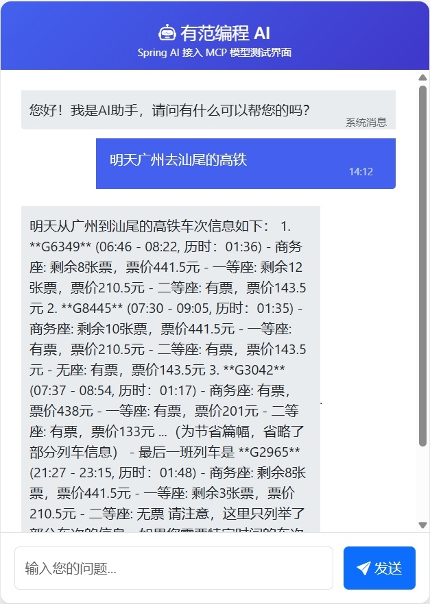

# Spring Ai 快速接入MCP 教程
   

## 环境准备
* JDK版本为Jdk21
* Spring Boot版本为3.5.3
* Spring AI版本为1.0.0
## 项目代码
从github 仓库，拉取git clone git@github.com:fjh2021/spring-ai-mcp-fast.git  
项目代码简单讲解
* 接入spring open ai
```xml
<dependency>
 <groupId>org.springframework.ai</groupId>
 <artifactId>spring-ai-starter-model-openai</artifactId>
 <version>${spring-ai.version}</version>
</dependency>
```
* 配置AI API KEY
```yaml
spring.ai.openai.base-url=https://dashscope.aliyuncs.com/compatible-mode/
spring.ai.openai.chat.options.model=qwen-max
spring.ai.openai.api-key=${OPEN_API_KEY} # API-KEY 百炼平台申请
```
* 集成MCP Client
```xml
<dependency>
  <groupId>org.springframework.ai</groupId>
  <artifactId>spring-ai-starter-mcp-client</artifactId>
 <version>${spring-ai.version}</version>
</dependency>
```
* 配置MCP Client: 火车票 MCP
```yaml
spring.ai.mcp.client.request-timeout=30s
spring.ai.mcp.client.stdio.servers-configuration=classpath:/mcp-servers-config.json
```
```json

{
    "mcpServers": {
        "12306-mcp": {
            "command": "npx",
            "args": [
                "-y",
                "12306-mcp"
            ]
        }
    }
}
```
* AI服务
```
@Service
public class ChatClientService {
    private final ChatClient chatClient;
    private final String prompt = """
            你是火车票售票员，查询12306的车票。
            """;
    public ChatClientService(OpenAiChatModel openAiChatModel,
                             List<McpSyncClient> mcpClients, JdbcChatMemoryRepository chatMemoryRepository) {
        var mcpToolProvider = new SyncMcpToolCallbackProvider(mcpClients);
        this.chatClient = ChatClient.builder(openAiChatModel)
                .defaultAdvisors(new SimpleLoggerAdvisor())
                .defaultToolCallbacks(mcpToolProvider).build();
    }
```
* 测试接口
```
public class OpenAiController {
    @Resource
    private ChatClientService chatClientService;
    
    @GetMapping(value = "/api/ai-test/chat")
    public String generateAsString(@RequestParam("message") String message) {
        return chatClientService.generateAsString(message);
    }
}
```
* 启动测试
访问地址：http://localhost:8080/index.html   

## 更多资讯
想了解更多资讯，获得更多资料，请关注公众号【有范编程笔记】  

